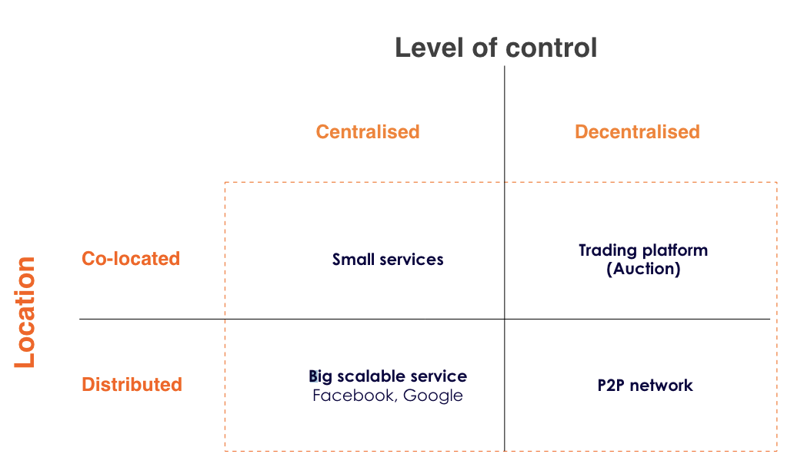
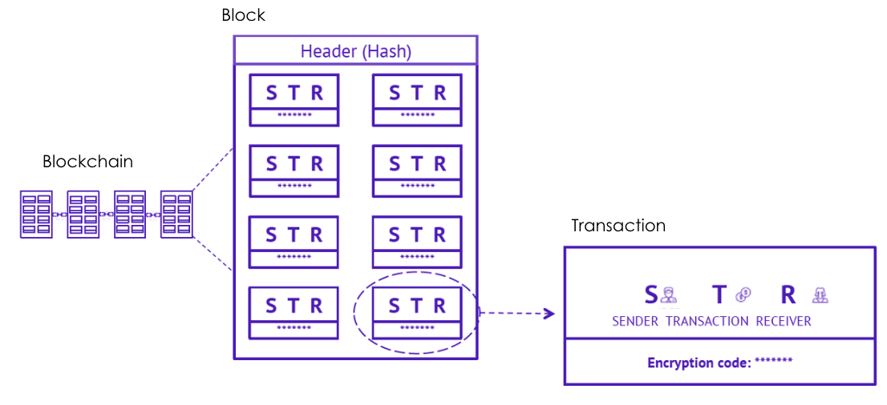

# Lesson 3

## Agenda

1. Decentralisation
2. Blockchain core concepts
3. The Blocks
4. Hashing
5. Visualising Blockchain

## The difference among Decentralization and Distributed ledger

**Decentralization** refers to the distribution
of control and decision-making power
away from a central authority. In the
context of blockchain, decentralization
means that no single entity has control
over the network. Instead, the network is
run by a group of nodes that are all
connected to each other and work
together to maintain the network's
integrity.

**Distributed**, on the other hand, refers to
the physical distribution of data or
computing resources across a network.
In the context of blockchain, distributed
means that the data and computing
resources required to maintain the
network are spread out across multiple
nodes. This is what makes blockchain
technology so resilient and secure – even
if one or several nodes go offline, the
network can still function because the
other nodes can take over their
responsibilities.

## Understanding decentralisation & distribution

## Methods of decentralization

**Fully Centralized:** Current financial system
**Semi-decentralized:** For instance when multiple service providers compete to win a contract
**Fully decentralized:** For example bitcoin

## CORE CONCEPTS

- Nodes: The nodes are the participants or entities that are representing the Blockchain community. They are computers, laptop, servers owned by individuals or organizations.

- Transactions: Each transaction that is taking place among two or more nodes of the blockchain in registered in the blockchain (hashed)
  `
- Block: Each block contains several transactions, that are grouped and registered consistently in the blockchain via consensus mechanisms

- Ledger: The ledger is a distributed public registry hosted in all the nodes, that are part of the community, where all the blocks of transactions are chained and registered sequentially

