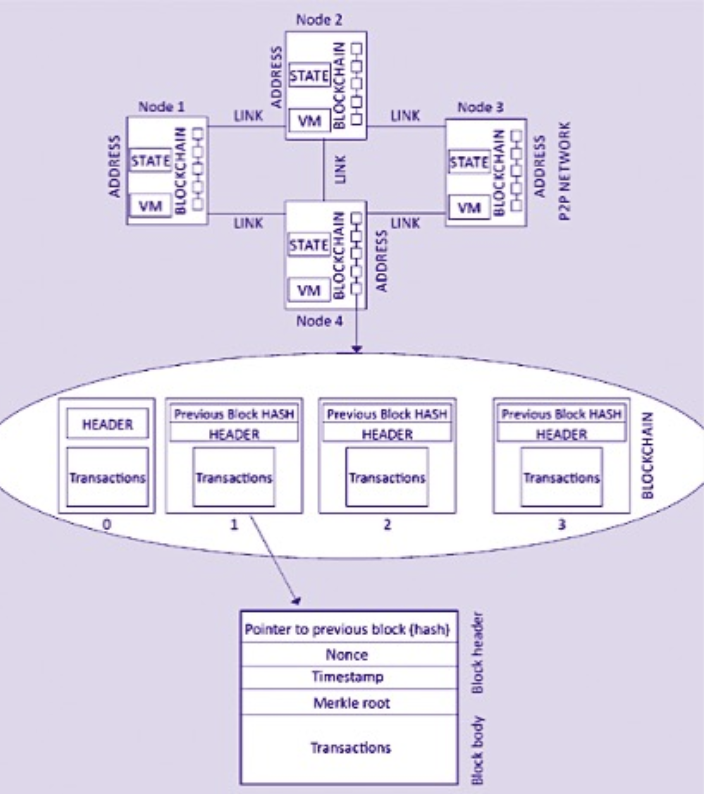
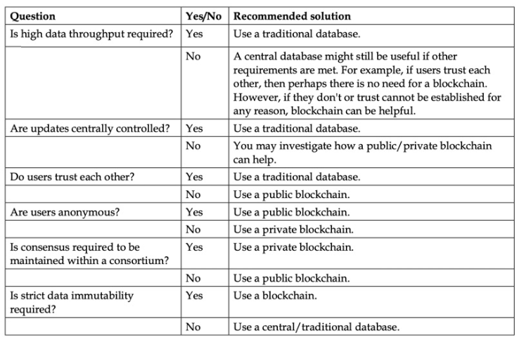
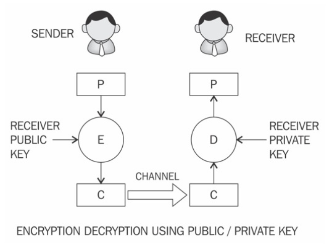
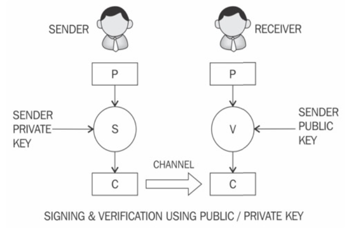
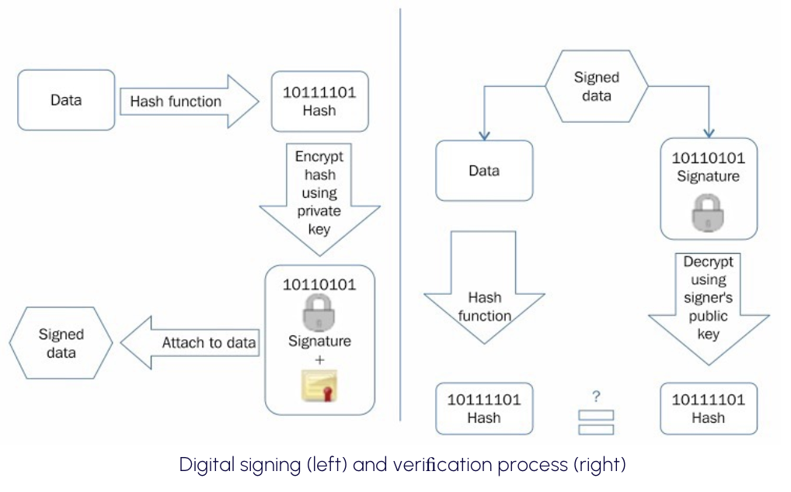
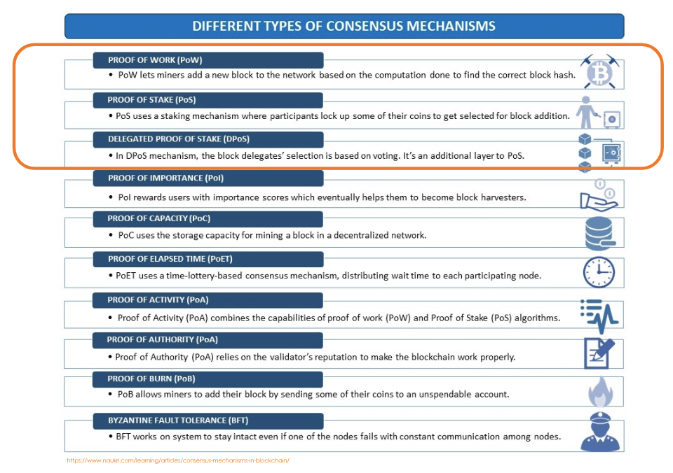
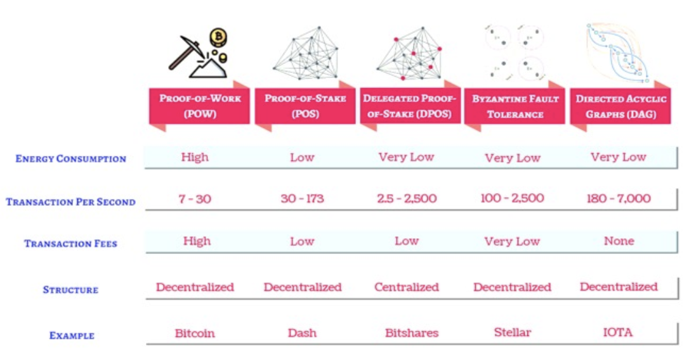

# Lesson 4

## Agenda

1. HIGH LEVEL CONSIDERATIONS
2. CATEGORISATIONS OF DLTs
3. APPLICATION OF CRYPTOGRAPHIC HASH FUNCTIONS IN BLOCKCHAIN
4. CONSENSUS PROCESS
5. CONSENSUS TYPES

## High level complete digram

<center></center>

## Benefits
1. Decentralization
2. Transparency and Trust
3. Immutability
4. High availability
5. Highly secure
6. Sreamline and simplification of processes
7. Quick settlement (compared to analogue processes)
8. Cost-saving
9. Distributed and trusted application platform
10. Programmable property

## IS BLOCKCHAIN ALWAYS GOOD? NOT REALLY

<center></center>

## Nowadays limitations

1. New technology
2. Scalability
3. Privacy and confidentiality
4. Limited Adoption
5. Interoperability
6. Regulation

## Categorisation of DLT Different deployments & operations

```dot
digraph CategOfDLT {
    DLT
    DLT -> "Blockchain"
    DLT -> "Distributed Ledgers"
    "Blockchain" -> "Private"
    "Blockchain" -> "Public"
    "Blockchain" -> "Consortium"
    "Blockchain" -> Application specific"
    "Blockchain" -> "Sidechains"
    "Sidechains" -> "1-way pegged"
    "Sidechains" -> "2-way pegged"
    "Distributed Ledgers" -> "Specific Purpose"
}
```

### Table

| | | Access | |
| - | - | - | - |
| | | Closed | Open |
| Control | Limited | **DLT** ***Permissioned / Private*** <label style="font-size: 10px; color: yellow;">Eg. Hyperledger</label> | **NA** |
| | Distributed | **Hybrid** <label style="font-size: 10px; color: yellow;">Eg. Ripple</label> | **Blockchain** ***Permissionless / Public*** <label style="font-size: 10px; color: yellow;">Eg. Bitcoin, Ethereum</label> |

## Trust Governance and Properties

| Characteristic | Ethereum | Hyperledger Frabric | R3 Corda |
| - | - | - | - |
| Description of platform | Generic blockchain platform | Modular blockchain platform | Specialized distributed ledger platform for financial industry |
| Governance | Ethereum developers | Linux Foundation | R3 |
| Mode of operation | Permissionless public or private | Permissioned private | Permissioned private |
| Consensus | POW now POS <br/> Ledger level | Broad understanding of consensus that allows multiple approaches <br/> Transaction level | Specific understanding of consensus (i.e. notary nodes) <br/> Transaction level |
| Smart contracts | Smart contract code | Smart contract code (e.g Go, Java) | Smart contract code (e.g. Kotlin, Java) <br/> Smart legal contract (legal prose) |
| Currency | Ether <br/> Tokens via smart contract | None <br/> Currency and tokens via chaincode | None |

## Distributed consensus

Requirements
1. Agreement
2. Integrity
3. Validity
4. Fault tolerant
5. Termination

## Application of cryptographic hash functions in Blockchain
- Hash functions are used in cryptographic puzzles such as the Proof of Work (PoW) mechanism in Bitcoin.
- The generation of addresses in blockchains. For example, in Ethereum, blockchain accounts are represented as addresses. Keccak-256 hash algorithm value.
- Message digests in digital signatures.
- The creations of <a href="https://en.wikipedia.org/wiki/Merkle_tree" target="_blank">Merkle trees</a> to guarantee the integrity of transaction structure in the blockchain.

## Asymmetric cryptography

1. Encryption and decryption: where the sender uses the receiver's public key to encrypt, and the receiver uses
2. their private key to decrypt the message

<center></center>

## Signing and verification

Signing and verification: where the sender uses their private key to sign, and the receiver uses the sender's public key to verify that the message has indeed been sent from the sender

<center></center>

## Digital signature

<center></center>

## Distributed consensus

<center></center>

## Comparison of consensus algorithms

<center></center>