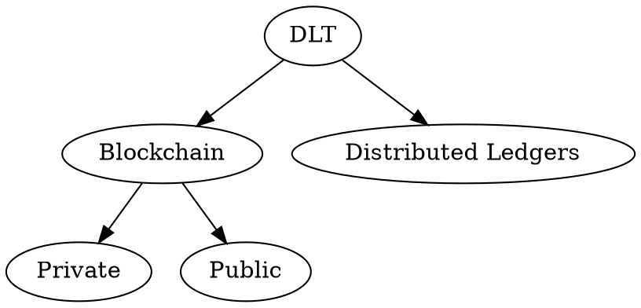

# Lesson 4

## Agenda

1. HIGH LEVEL CONSIDERATIONS
2. CATEGORISATIONS OF DLTs
3. APPLICATION OF CRYPTOGRAPHIC HASH FUNCTIONS IN BLOCKCHAIN
4. CONSENSUS PROCESS
5. CONSENSUS TYPES

## High level complete digram

## Benefits
1. Decentralization
2. Transparency and Trust
3. Immutability
4. High availability
5. Highly secure
6. Sreamline and simplification of processes
7. Quick settlement (compared to analogue processes)
8. Cost-saving
9. Distributed and trusted application platform
10. Programmable property

## IS BLOCKCHAIN ALWAYS GOOD? NOT REALLY

## Nowadays limitations

1. New technology
2. Scalability
3. Privacy and confidentiality
4. Limited Adoption
5. Interoperability
6. Regulation

## Categorisation of DLT Different deployments & operations

