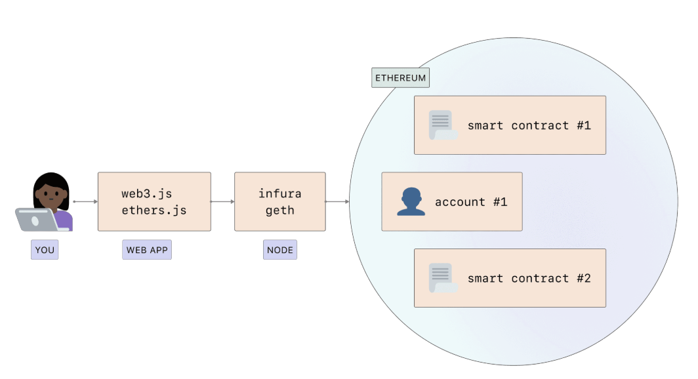

# Lesson 5

## Agenda
1. Introduction to Blockchain Coding
2. Languages
3. Ethereum Blockchain
4. Genesis
5. Setup Network

## Introduction to Blockchain Coding

## Smart Contract Language

- Solidity (similar to javascript)
  - Ethereum
  - Ethereum Classic
  - Polkadot
  - Zhcash
  - Tron
  - Avalanche
  - ...
- Vyper (similar to Python)
  - Ethereum
  - Polkadot
  - Uniswap
- Rust
  - Solana
  - Polkadot
- Yul
- Cairo

## Steps for Development

- Setup blockchain 
  - Choose type of Network (Public, private etc)
  - Create accounts with keypairs (public/private)
  - Install Ethereum client (Geth, Besu etc)
  - Configure client (genesis file)
  - Start client
- Develop Smart Contract
- Test Smart Contract
- Deploy Smart Contract
- Develop DApp
- Test DApp
- Deploy DApp

