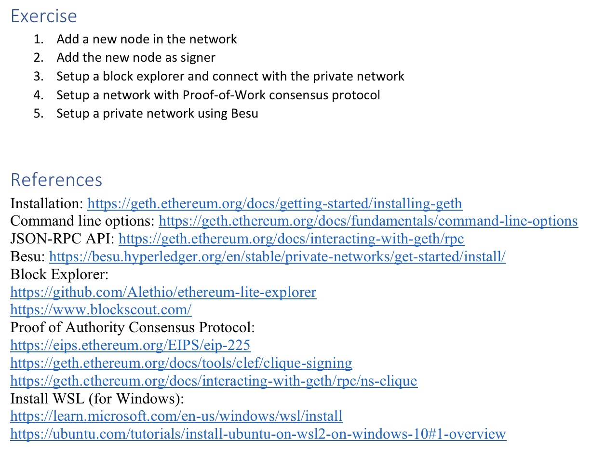

# Lesson 7

## Setup a Private Blockchain Network

- Install Ethereum
  - Enable repository
  ```
  sudo add-apt-repository ppa:ethereum/ethereum
  ```
  - Install Ethereum
  ```
  sudo apt update
  ```
  ```
  sudo apt install ethereum
  ```
  - Verify installation
  ```
  geth version
  ```
- Create directories
  ```
  mkdir network1 && cd network1 && mkdir bootnode && mkdir node1 && mkdir node2 && mkdir node3
  ```
- Create Accounts
  After generating the account, save the public address of the key which will be needed to generate the genesis file and to run the node. Save the password in the password.txt file under each node directory if you set any password for the account
  - Node 1 - Generate new account
  ```
  geth --datadir node1/ account new
  ```
  - Node 1 - Create password file
  ```
  touch node1/password.txt
  ```
  - Node 2 - Generate new account
  ```
  geth --datadir node2/ account new
  ```
  - Node 2 - Create password file
  ```
  touch node2/password.txt
  ```
  - Node 3 - Generate new account
  ```
  geth --datadir node3/ account new
  ```
  - Node 3 - Create password file
  ```
  touch node3/password.txt
  ```
- Create Genesis Block
  - Install Puppeth
  ```
  sudo apt install puppeth
  ```
  - Create Genesis File
  ```
  puppeth
  ```
  You need to use the public addresses in the following steps to generate the genesis file during thesteps “which accounts are allowed to seal” and “which accounts should be pre-funded”.

  For instance: network1

    * What would you like to do?
    * > 2 -> Configure new genesis
    * What would you like to do?
    * > 1 -> Create new genesis from scratch
    * Which consensus engine to use?
    * > 2 -> Clique - proof-of-authority
    * Which accounts are allowed to seal?
    * > Here you put the accounts that are already created
    * Which accounts should be pre-funded?
    * > Here you put also the accounts addresses
  - Initialize Genesis Block
    - Node 1
  ```
  geth --datadir node1/ init network1.json
  ```
    - Node 2
  ```
  geth --datadir node2/ init network1.json
  ```
    - Node 3
  ```
  geth --datadir node3/ init network1.json
  ```
- Run Bootnode
  - Generate Key
  ```
  bootnode -genkey boot.key
  ```
  - Start Bootnode
  ```
  bootnode -nodekey boot.key
  ```
  Copy the enode address which will be required in the successive steps.
- Run Node
  Replace the following parameters before running the commands
    * bootnodes: replace with your bootnode address
    * miner.etherbase: replace with your account address
    * unlock: replace with your account address
    * password: replace with the path of your password file
  - Start Node 1
    ```bash
    geth --datadir ~/network1/node1/ \
    --syncmode "full" \
    --port 30303 \
    --http --http.port 8545 --http.api "personal,admin,eth,net,web3,txpool,miner,clique,debug" \
    --http.corsdomain "*" \
    --authrpc.port 8551 \
    --ws --ws.port 8546 --ws.origins "*" --ws.api "eth,net,web3,debug,txpool" \
    --miner.etherbase "0x474B3BE9673EFBE8c6713278f945B2C8934333DD" \
    --bootnodes
    "enode://94030e5e807426d3126851e07352672b6784981be776b66adfd895de88899d12d88f5f3b68a3bcd6738ed86
    4efeae7ad1191cb9f26ce143c72273afd0df888e8@127.0.0.1:30301" \
    --allow-insecure-unlock \
    --unlock "0x474B3BE9673EFBE8c6713278f945B2C8934333DD" \
    --password "/home/ubuntu/network1/node1/password.txt" \
    --networkid 1971 \
    --verbosity=3 \
    --mine
    ```
  - Start Node 2
    ```bash
    geth --datadir ~/network1/node2/ \
    --syncmode "full" \
    --port 30304 \
    --http --http.port 8555 --http.api "personal,admin,eth,net,web3,txpool,miner,clique,debug" \
    --http.corsdomain "*" \
    --authrpc.port 8552 \
    --ws --ws.port 8556 --ws.origins "*" --ws.api "eth,net,web3,debug,txpool" \
    --miner.etherbase "0x7c7B266E4b23588cD870f096FD7a8D1910187bEf" \
    --bootnodes
    "enode://94030e5e807426d3126851e07352672b6784981be776b66adfd895de88899d12d88f5f3b68a3bcd6738ed86
    4efeae7ad1191cb9f26ce143c72273afd0df888e8@127.0.0.1:30301" \
    --allow-insecure-unlock \
    --unlock "0x7c7B266E4b23588cD870f096FD7a8D1910187bEf" \
    --password "/home/ubuntu/network1/node2/password.txt" \
    --networkid 1971 \
    --verbosity=3 \
    --mine
    ```
  - Start Node 3
    ```bash
    geth --datadir ~/network1/node3/ \
    --syncmode "full" \
    --port 30305 \
    --http --http.port 8565 --http.api "personal,admin,eth,net,web3,txpool,miner,clique,debug" \
    --http.corsdomain "*" \
    --authrpc.port 8553 \
    --ws --ws.port 8566 --ws.origins "*" --ws.api "eth,net,web3,debug,txpool" \
    --miner.etherbase "0xF461EB5Ebe131DaC9a00368d3deB96516C33BDBe" \
    --bootnodes
    "enode://94030e5e807426d3126851e07352672b6784981be776b66adfd895de88899d12d88f5f3b68a3bcd6738ed86
    4efeae7ad1191cb9f26ce143c72273afd0df888e8@127.0.0.1:30301" \
    --allow-insecure-unlock \
    --unlock "0xF461EB5Ebe131DaC9a00368d3deB96516C33BDBe" \
    --password "/home/ubuntu/network1/node3/password.txt" \
    --networkid 1971 \
    --verbosity=3 \
    --mine
    ```
- Interacting with Geth
  - Connect to Geth Console
  ```bash
  geth attach http://localhost:8545
  ```
  - Run commands in Geth Console
    - Show peer nodes
    ```
    geth attach http://localhost:8545
    ```
    - Show balance
    ```
    eth.getBalance("0x474B3BE9673EFBE8c6713278f945B2C8934333DD")
    ```
    - Send ether
    ```
    eth.sendTransaction({from: "0x474B3BE9673EFBE8c6713278f945B2C8934333DD",to:
    "0x7c7B266E4b23588cD870f096FD7a8D1910187bEf", value: "90000000000"})
    ```
    - Get transaction
    ```
    eth.getTransaction("0xb9a11c89b4efe99f4ef24f36f4347a2fecff27b452c9e013437fce59e324585f")
    ```

<center></center>
